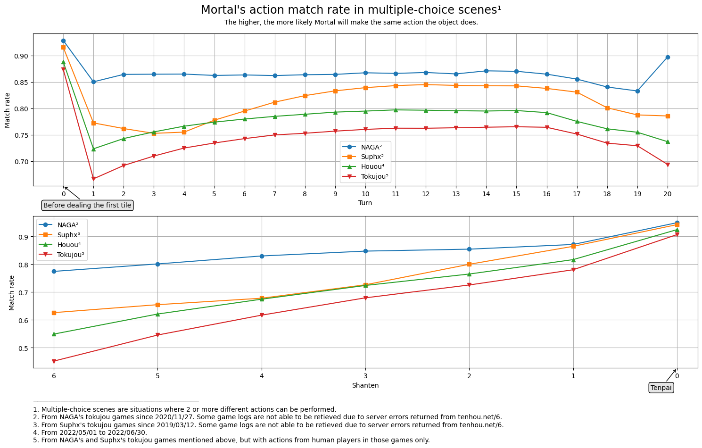

# Strength
## Simulation environment
The simulation uses a 1v3 duplicate mahjong setting as follows

| Table | East start | South start | West start | North start |
|:---:|:---:|:---:|:---:|:---:|
| 1 | Challenger | Champion | Champion | Champion |
| 2 | Champion | Challenger | Champion | Champion |
| 3 | Champion | Champion | Challenger | Champion |
| 4 | Champion | Champion | Champion | Challenger |

In this setting, every 4 games are initialized with same random seed. The emulator guarantees that with the same (seed, kyoku, honba) tuple, the yama, haipai, dora/ura indicators and rinshan tiles are deterministic and reproducible.

The emulator is implemented in [`libriichi::arena`](https://github.com/Equim-chan/Mortal/tree/main/libriichi/src/arena).

The "rank pt" in all the tables are calculated using a distribution of [90, 45, 0, -135].

The name of the current best model is highlighted.

## Mortal vs akochan (jun_pt = [90, 45, 0, -135])
Challenger is akochan and Champion is Mortal.

### mortal1-b40c192-t22040618

|  | akochan (x1) | **mortal1-b40c192-t22040618** (x3) |
|---:|:---|:---|
| Games | 23432 | 70296 |
| Rounds | 250168 | 750504 |
| Rounds as dealer | 61330 | 188838 |
|  |  |  |
| 1st (rate) | 5582 (0.238221) | 17850 (0.253926) |
| 2nd (rate) | 5521 (0.235618) | 17911 (0.254794) |
| 3rd (rate) | 5894 (0.251536) | 17538 (0.249488) |
| 4th (rate) | 6435 (0.274624) | 16997 (0.241792) |
| Tobi(rate) | 1916 (0.081769) | 4426 (0.062962) |
| Avg rank | 2.562564 | 2.479145 |
| Total rank pt | -117900 | 117900 |
| Avg rank pt | -5.031581 | **1.677194** 👑 |
| Total Δscore | -28694400 | 28694400 |
| Avg game Δscore | -1224.581769 | 408.193923 |
| Avg round Δscore | -114.700521 | 38.233507 |
|  |  |  |
| Win rate | 0.195952 | 0.213570 |
| Deal-in rate | 0.131907 | 0.114841 |
| Call rate | 0.333208 | 0.296321 |
| Riichi rate | 0.215923 | 0.181443 |
| Ryukyoku rate | 0.168335 | 0.168335 |
|  |  |  |
| Avg winning Δscore | 6747.283817 | 6483.038962 |
| Avg winning Δscore as dealer | 8812.331701 | 8439.922489 |
| Avg winning Δscore as non-dealer | 5996.378202 | 5727.687944 |
| Avg riichi winning Δscore | 8271.697489 | 8079.942256 |
| Avg open winning Δscore | 4976.754839 | 4976.946811 |
| Avg dama winning Δscore | 7745.257453 | 6515.832517 |
| Avg ryukyoku Δscore | 77.555091 | -25.851697 |
|  |  |  |
| Avg winning turn | 11.182881 | 11.129126 |
| Avg riichi winning turn | 11.249845 | 11.126644 |
| Avg open winning turn | 11.117438 | 11.086393 |
| Avg dama winning turn | 11.120403 | 11.264727 |
|  |  |  |
| Avg deal-in turn | 11.617261 | 11.485306 |
| Avg deal-in Δscore | -5334.579836 | -5332.635255 |
| Avg deal-in Δscore to dealer | -7075.531317 | -7104.268622 |
| Avg deal-in Δscore to non-dealer | -4692.321414 | -4716.800350 |
|  |  |  |
| Chasing riichi rate | 0.148842 | 0.180357 |
| Riichi chased rate | 0.182350 | 0.175775 |
| Winning rate after riichi | 0.447470 | 0.485805 |
| Deal-in rate after riichi | 0.159913 | 0.149147 |
| Avg riichi turn | 7.944443 | 7.798390 |
| Avg riichi Δscore | 2916.183794 | 3207.900187 |
|  |  |  |
| Avg number of calls | 1.433600 | 1.449355 |
| Winning rate after call | 0.267125 | 0.317703 |
| Deal-in rate after call | 0.145337 | 0.131733 |
| Avg call Δscore | 562.586674 | 907.807905 |
|  |  |  |
| Dealer wins/all dealer rounds | 0.213142 | 0.236388 |
| Dealer wins/all wins | 0.266661 | 0.278498 |
| Deal-in to dealer/all deal-ins | 0.269493 | 0.257945 |
|  |  |  |
| Yakuman (rate) | 21 (0.000083944) | 112 (0.000149233) |
| Nagashi mangan (rate) | 0 (0.000000000) | 20 (0.000026649) |

### mortal3-b24c512-t22122709

|  | akochan (x1) | **mortal3-b24c512-t22122709** (x3) |
|---:|:---|:---|
| Games | 13152 | 39456 |
| Rounds | 140132 | 420396 |
| Rounds as dealer | 34602 | 105530 |
|  |  |  |
| 1st (rate) | 3121 (0.237302) | 10031 (0.254233) |
| 2nd (rate) | 3116 (0.236922) | 10036 (0.254359) |
| 3rd (rate) | 3243 (0.246578) | 9909 (0.251141) |
| 4th (rate) | 3672 (0.279197) | 9480 (0.240268) |
| Tobi(rate) | 1028 (0.078163) | 2439 (0.061816) |
| Avg rank | 2.567670 | 2.477443 |
| Total rank pt | -74610 | 74610 |
| Avg rank pt | -5.672901 | **1.890967** 👑 |
| Total Δscore | -14601500 | 14601500 |
| Avg game Δscore | -1110.211375 | 370.070458 |
| Avg round Δscore | -104.198185 | 34.732728 |
|  |  |  |
| Win rate | 0.195352 | 0.212157 |
| Deal-in rate | 0.130420 | 0.112613 |
| Call rate | 0.330075 | 0.293685 |
| Riichi rate | 0.215304 | 0.189110 |
| Ryukyoku rate | 0.172801 | 0.172801 |
|  |  |  |
| Avg winning Δscore | 6807.616438 | 6510.059424 |
| Avg winning Δscore as dealer | 9027.834773 | 8508.379567 |
| Avg winning Δscore as non-dealer | 5983.888416 | 5760.331190 |
| Avg riichi winning Δscore | 8404.128236 | 8146.596125 |
| Avg open winning Δscore | 4985.047857 | 4842.311007 |
| Avg dama winning Δscore | 7606.341789 | 6749.915065 |
| Avg ryukyoku Δscore | 90.192030 | -30.064010 |
|  |  |  |
| Avg winning turn | 11.143854 | 11.182128 |
| Avg riichi winning turn | 11.242041 | 11.182500 |
| Avg open winning turn | 11.055497 | 11.142524 |
| Avg dama winning turn | 10.995995 | 11.320519 |
|  |  |  |
| Avg deal-in turn | 11.714325 | 11.457247 |
| Avg deal-in Δscore | -5299.611512 | -5284.607748 |
| Avg deal-in Δscore to dealer | -6995.398902 | -7088.703069 |
| Avg deal-in Δscore to non-dealer | -4706.123504 | -4674.846678 |
|  |  |  |
| Chasing riichi rate | 0.157370 | 0.180702 |
| Riichi chased rate | 0.183255 | 0.179620 |
| Winning rate after riichi | 0.445593 | 0.485013 |
| Deal-in rate after riichi | 0.159557 | 0.149470 |
| Avg riichi turn | 7.954758 | 7.815939 |
| Avg riichi Δscore | 2979.530012 | 3245.600684 |
|  |  |  |
| Avg number of calls | 1.441908 | 1.435309 |
| Winning rate after call | 0.268798 | 0.319494 |
| Deal-in rate after call | 0.145285 | 0.124854 |
| Avg call Δscore | 592.184460 | 914.366131 |
|  |  |  |
| Dealer wins/all dealer rounds | 0.214092 | 0.230579 |
| Dealer wins/all wins | 0.270612 | 0.272822 |
| Deal-in to dealer/all deal-ins | 0.259247 | 0.252609 |
|  |  |  |
| Yakuman (rate) | 16 (0.000114178) | 49 (0.000116557) |
| Nagashi mangan (rate) | 0 (0.000000000) | 46 (0.000109421) |

## Mortal vs akochan (jun_pt = [90, 30, -30, -90])
### mortal1-b40c192-t22040618

|  | akochan (x1) | **mortal1-b40c192-t22040618** (x3) |
|---:|:---|:---|
| Games | 24388 | 73164 |
| Rounds | 259986 | 779958 |
| Rounds as dealer | 63936 | 196050 |
|  |  |  |
| 1st (rate) | 6047 (0.247950) | 18341 (0.250683) |
| 2nd (rate) | 5887 (0.241389) | 18501 (0.252870) |
| 3rd (rate) | 5470 (0.224291) | 18918 (0.258570) |
| 4th (rate) | 6984 (0.286370) | 17404 (0.237877) |
| Tobi(rate) | 2058 (0.084386) | 4580 (0.062599) |
| Avg rank | 2.549082 | 2.483639 |
| Total rank pt | -133695 | 133695 |
| Avg rank pt | -5.481999 | **1.827333** 👑 |
| Total Δscore | -24085000 | 24085000 |
| Avg game Δscore | -987.575857 | 329.191952 |
| Avg round Δscore | -92.639604 | 30.879868 |
|  |  |  |
| Win rate | 0.197126 | 0.213935 |
| Deal-in rate | 0.138531 | 0.114030 |
| Call rate | 0.331276 | 0.296377 |
| Riichi rate | 0.225578 | 0.180537 |
| Ryukyoku rate | 0.166147 | 0.166147 |
|  |  |  |
| Avg winning Δscore | 6887.453659 | 6442.207240 |
| Avg winning Δscore as dealer | 9107.688304 | 8355.842889 |
| Avg winning Δscore as non-dealer | 6097.529166 | 5710.956124 |
| Avg riichi winning Δscore | 8426.118884 | 8015.720543 |
| Avg open winning Δscore | 5089.079611 | 4977.606459 |
| Avg dama winning Δscore | 7552.749577 | 6456.614746 |
| Avg ryukyoku Δscore | 168.024817 | -56.008272 |
|  |  |  |
| Avg winning turn | 11.229112 | 11.082213 |
| Avg riichi winning turn | 11.295316 | 11.068438 |
| Avg open winning turn | 11.173257 | 11.056963 |
| Avg dama winning turn | 11.048223 | 11.199211 |
|  |  |  |
| Avg deal-in turn | 11.619114 | 11.451006 |
| Avg deal-in Δscore | -5321.343292 | -5345.643643 |
| Avg deal-in Δscore to dealer | -6970.939034 | -7139.180226 |
| Avg deal-in Δscore to non-dealer | -4706.768293 | -4734.051536 |
|  |  |  |
| Chasing riichi rate | 0.166999 | 0.176882 |
| Riichi chased rate | 0.173581 | 0.183203 |
| Winning rate after riichi | 0.441182 | 0.488023 |
| Deal-in rate after riichi | 0.159309 | 0.150216 |
| Avg riichi turn | 8.046447 | 7.780905 |
| Avg riichi Δscore | 2947.654611 | 3181.566071 |
|  |  |  |
| Avg number of calls | 1.444425 | 1.453448 |
| Winning rate after call | 0.267187 | 0.320407 |
| Deal-in rate after call | 0.153808 | 0.131492 |
| Avg call Δscore | 564.244662 | 914.957043 |
|  |  |  |
| Dealer wins/all dealer rounds | 0.210351 | 0.235312 |
| Dealer wins/all wins | 0.262420 | 0.276477 |
| Deal-in to dealer/all deal-ins | 0.271435 | 0.254287 |
|  |  |  |
| Yakuman (rate) | 31 (0.000119237) | 163 (0.000208986) |
| Nagashi mangan (rate) | 0 (0.000000000) | 15 (0.000019232) |

## Mortal vs Mortal
### mortal2-b75c256-t22092920 and mortal1-b40c192-t22040618

|  | **mortal2-b75c256-t22092920** (x1) | mortal1-b40c192-t22040618 (x3) |
|---:|:---|:---|
| Games | 426000 | 1278000 |
| Rounds | 4568485 | 13705455 |
| Rounds as dealer | 1130506 | 3437979 |
|  |  |  |
| 1st (rate) | 107160 (0.251549) | 318840 (0.249484) |
| 2nd (rate) | 106427 (0.249829) | 319573 (0.250057) |
| 3rd (rate) | 105945 (0.248697) | 320055 (0.250434) |
| 4th (rate) | 106468 (0.249925) | 319532 (0.250025) |
| Tobi(rate) | 27006 (0.063394) | 87330 (0.068333) |
| Avg rank | 2.496998 | 2.501001 |
| Total rank pt | 60435 | -60435 |
| Avg rank pt | **0.141866** 👑 | -0.047289 |
| Total Δscore | 18652900 | -18652900 |
| Avg game Δscore | 43.786150 | -14.595383 |
| Avg round Δscore | 4.082951 | -1.360984 |
|  |  |  |
| Win rate | 0.201100 | 0.210842 |
| Deal-in rate | 0.113477 | 0.119711 |
| Call rate | 0.288314 | 0.295943 |
| Riichi rate | 0.173797 | 0.182667 |
| Ryukyoku rate | 0.170837 | 0.170837 |
|  |  |  |
| Avg winning Δscore | 6624.815505 | 6436.649081 |
| Avg winning Δscore as dealer | 8550.270545 | 8377.695608 |
| Avg winning Δscore as non-dealer | 5882.672301 | 5698.101070 |
| Avg riichi winning Δscore | 8235.661556 | 8026.424142 |
| Avg open winning Δscore | 5149.989008 | 4928.198868 |
| Avg dama winning Δscore | 6460.737173 | 6446.738607 |
| Avg ryukyoku Δscore | -67.458884 | 22.486295 |
|  |  |  |
| Avg winning turn | 11.073204 | 11.143723 |
| Avg riichi winning turn | 11.087846 | 11.151681 |
| Avg open winning turn | 11.010515 | 11.089835 |
| Avg dama winning turn | 11.225206 | 11.282352 |
|  |  |  |
| Avg deal-in turn | 11.502015 | 11.482273 |
| Avg deal-in Δscore | -5235.412861 | -5323.966492 |
| Avg deal-in Δscore to dealer | -6947.785537 | -7033.802381 |
| Avg deal-in Δscore to non-dealer | -4646.055777 | -4717.602231 |
|  |  |  |
| Chasing riichi rate | 0.163332 | 0.164827 |
| Riichi chased rate | 0.174174 | 0.168552 |
| Winning rate after riichi | 0.483505 | 0.479043 |
| Deal-in rate after riichi | 0.147938 | 0.149382 |
| Avg riichi turn | 7.751164 | 7.814533 |
| Avg riichi Δscore | 3278.816709 | 3131.209817 |
|  |  |  |
| Avg number of calls | 1.468083 | 1.444199 |
| Winning rate after call | 0.307361 | 0.312322 |
| Deal-in rate after call | 0.135190 | 0.136126 |
| Avg call Δscore | 920.822027 | 858.670427 |
|  |  |  |
| Dealer wins/all dealer rounds | 0.226089 | 0.231663 |
| Dealer wins/all wins | 0.278207 | 0.275619 |
| Deal-in to dealer/all deal-ins | 0.256050 | 0.261793 |
|  |  |  |
| Yakuman (rate) | 657 (0.000143811) | 2103 (0.000153443) |
| Nagashi mangan (rate) | 92 (0.000020138) | 403 (0.000029404) |

Swapping Challenger and Champion.

|  | **mortal1-b40c192-t22040618** (x1) | mortal2-b75c256-t22092920 (x3) |
|---:|:---|:---|
| Games | 404000 | 1212000 |
| Rounds | 4364061 | 13092183 |
| Rounds as dealer | 1103344 | 3260717 |
|  |  |  |
| 1st (rate) | 100909 (0.249775) | 303091 (0.250075) |
| 2nd (rate) | 101357 (0.250884) | 302643 (0.249705) |
| 3rd (rate) | 101105 (0.250260) | 302895 (0.249913) |
| 4th (rate) | 100629 (0.249082) | 303371 (0.250306) |
| Tobi(rate) | 29033 (0.071864) | 81611 (0.067336) |
| Avg rank | 2.498649 | 2.500450 |
| Total rank pt | 57960 | -57960 |
| Avg rank pt | **0.143465** 👑 | -0.047822 |
| Total Δscore | 13969900 | -13969900 |
| Avg game Δscore | 34.578960 | -11.526320 |
| Avg round Δscore | 3.201124 | -1.067041 |
|  |  |  |
| Win rate | 0.212621 | 0.201806 |
| Deal-in rate | 0.118069 | 0.112019 |
| Call rate | 0.296154 | 0.287104 |
| Riichi rate | 0.185261 | 0.176752 |
| Ryukyoku rate | 0.186210 | 0.186210 |
|  |  |  |
| Avg winning Δscore | 6468.779812 | 6662.244567 |
| Avg winning Δscore as dealer | 8402.976332 | 8583.978730 |
| Avg winning Δscore as non-dealer | 5726.791793 | 5914.078352 |
| Avg riichi winning Δscore | 8071.102088 | 8282.872970 |
| Avg open winning Δscore | 4920.254645 | 5141.249336 |
| Avg dama winning Δscore | 6487.726056 | 6499.767462 |
| Avg ryukyoku Δscore | 69.193852 | -23.064617 |
|  |  |  |
| Avg winning turn | 11.226868 | 11.165918 |
| Avg riichi winning turn | 11.219288 | 11.171787 |
| Avg open winning turn | 11.184648 | 11.112177 |
| Avg dama winning turn | 11.369596 | 11.309909 |
|  |  |  |
| Avg deal-in turn | 11.524012 | 11.554706 |
| Avg deal-in Δscore | -5461.129451 | -5379.466500 |
| Avg deal-in Δscore to dealer | -7145.173422 | -7080.005371 |
| Avg deal-in Δscore to non-dealer | -4849.924613 | -4777.221692 |
|  |  |  |
| Chasing riichi rate | 0.162070 | 0.159654 |
| Riichi chased rate | 0.162165 | 0.166870 |
| Winning rate after riichi | 0.478268 | 0.481330 |
| Deal-in rate after riichi | 0.146050 | 0.145433 |
| Avg riichi turn | 7.864415 | 7.809567 |
| Avg riichi Δscore | 3166.434464 | 3293.847974 |
|  |  |  |
| Avg number of calls | 1.435226 | 1.459294 |
| Winning rate after call | 0.310897 | 0.304871 |
| Deal-in rate after call | 0.133552 | 0.132994 |
| Avg call Δscore | 859.858175 | 912.474713 |
|  |  |  |
| Dealer wins/all dealer rounds | 0.233167 | 0.227058 |
| Dealer wins/all wins | 0.277256 | 0.280223 |
| Deal-in to dealer/all deal-ins | 0.266291 | 0.261529 |
|  |  |  |
| Yakuman (rate) | 675 (0.000154672) | 1843 (0.000140771) |
| Nagashi mangan (rate) | 140 (0.000032080) | 300 (0.000022914) |

### mortal2-b75c256-t22100115 and mortal1-b40c192-t22040618

|  | mortal2-b75c256-t22100115 (x1) | **mortal1-b40c192-t22040618** (x3) |
|---:|:---|:---|
| Games | 88000 | 264000 |
| Rounds | 938739 | 2816217 |
| Rounds as dealer | 232809 | 705930 |
|  |  |  |
| 1st (rate) | 23142 (0.262977) | 64858 (0.245674) |
| 2nd (rate) | 21440 (0.243636) | 66560 (0.252121) |
| 3rd (rate) | 20580 (0.233864) | 67420 (0.255379) |
| 4th (rate) | 22838 (0.259523) | 65162 (0.246826) |
| Tobi(rate) | 6158 (0.069977) | 18546 (0.070250) |
| Avg rank | 2.489932 | 2.503356 |
| Total rank pt | -35550 | 35550 |
| Avg rank pt | -0.403977 | **0.134659** 👑 |
| Total Δscore | 17452400 | -17452400 |
| Avg game Δscore | 198.322727 | -66.107576 |
| Avg round Δscore | 18.591323 | -6.197108 |
|  |  |  |
| Win rate | 0.201396 | 0.211725 |
| Deal-in rate | 0.120611 | 0.118825 |
| Call rate | 0.252337 | 0.297869 |
| Riichi rate | 0.214896 | 0.181350 |
| Ryukyoku rate | 0.167898 | 0.167898 |
|  |  |  |
| Avg winning Δscore | 6895.280813 | 6456.797252 |
| Avg winning Δscore as dealer | 8896.540353 | 8411.978003 |
| Avg winning Δscore as non-dealer | 6126.663299 | 5708.054700 |
| Avg riichi winning Δscore | 8226.234445 | 8055.765599 |
| Avg open winning Δscore | 5268.198657 | 4950.033985 |
| Avg dama winning Δscore | 6817.069924 | 6493.118161 |
| Avg ryukyoku Δscore | 33.715707 | -11.238569 |
|  |  |  |
| Avg winning turn | 11.181971 | 11.112885 |
| Avg riichi winning turn | 11.227615 | 11.129407 |
| Avg open winning turn | 11.090254 | 11.056002 |
| Avg dama winning turn | 11.307411 | 11.238720 |
|  |  |  |
| Avg deal-in turn | 11.509212 | 11.491703 |
| Avg deal-in Δscore | -5268.248220 | -5371.322657 |
| Avg deal-in Δscore to dealer | -6986.856002 | -7088.977424 |
| Avg deal-in Δscore to non-dealer | -4661.518881 | -4764.608616 |
|  |  |  |
| Chasing riichi rate | 0.183338 | 0.173439 |
| Riichi chased rate | 0.167614 | 0.188733 |
| Winning rate after riichi | 0.460896 | 0.482050 |
| Deal-in rate after riichi | 0.157304 | 0.149767 |
| Avg riichi turn | 7.970679 | 7.798867 |
| Avg riichi Δscore | 3023.188801 | 3154.216686 |
|  |  |  |
| Avg number of calls | 1.441297 | 1.447179 |
| Winning rate after call | 0.316803 | 0.313935 |
| Deal-in rate after call | 0.139772 | 0.135112 |
| Avg call Δscore | 997.837715 | 861.855676 |
|  |  |  |
| Dealer wins/all dealer rounds | 0.225344 | 0.233891 |
| Dealer wins/all wins | 0.277492 | 0.276910 |
| Deal-in to dealer/all deal-ins | 0.260921 | 0.261023 |
|  |  |  |
| Yakuman (rate) | 155 (0.000165115) | 510 (0.000181094) |
| Nagashi mangan (rate) | 29 (0.000030893) | 94 (0.000033378) |

Swapping Challenger and Champion.

|  | **mortal1-b40c192-t22040618** (x1) | mortal2-b75c256-t22100115 (x3) |
|---:|:---|:---|
| Games | 184000 | 552000 |
| Rounds | 1949267 | 5847801 |
| Rounds as dealer | 490808 | 1458459 |
|  |  |  |
| 1st (rate) | 43859 (0.238364) | 140141 (0.253879) |
| 2nd (rate) | 46785 (0.254266) | 137215 (0.248578) |
| 3rd (rate) | 49108 (0.266891) | 134892 (0.244370) |
| 4th (rate) | 44248 (0.240478) | 139752 (0.253174) |
| Tobi(rate) | 13951 (0.075821) | 42533 (0.077053) |
| Avg rank | 2.509484 | 2.496839 |
| Total rank pt | 79155 | -79155 |
| Avg rank pt | **0.430190** 👑 | -0.143397 |
| Total Δscore | -27210700 | 27210700 |
| Avg game Δscore | -147.884239 | 49.294746 |
| Avg round Δscore | -13.959452 | 4.653151 |
|  |  |  |
| Win rate | 0.214427 | 0.203815 |
| Deal-in rate | 0.114537 | 0.116552 |
| Call rate | 0.298879 | 0.252706 |
| Riichi rate | 0.182324 | 0.216687 |
| Ryukyoku rate | 0.178674 | 0.178674 |
|  |  |  |
| Avg winning Δscore | 6536.850290 | 6979.860891 |
| Avg winning Δscore as dealer | 8484.620894 | 8965.835300 |
| Avg winning Δscore as non-dealer | 5789.726810 | 6209.649582 |
| Avg riichi winning Δscore | 8147.536626 | 8309.278377 |
| Avg open winning Δscore | 5020.329473 | 5337.498028 |
| Avg dama winning Δscore | 6549.632467 | 6890.664374 |
| Avg ryukyoku Δscore | -27.239265 | 9.079755 |
|  |  |  |
| Avg winning turn | 11.155595 | 11.208098 |
| Avg riichi winning turn | 11.160617 | 11.252630 |
| Avg open winning turn | 11.102974 | 11.112422 |
| Avg dama winning turn | 11.299210 | 11.347049 |
|  |  |  |
| Avg deal-in turn | 11.557105 | 11.590087 |
| Avg deal-in Δscore | -5644.898169 | -5536.106677 |
| Avg deal-in Δscore to dealer | -7381.606863 | -7276.555470 |
| Avg deal-in Δscore to non-dealer | -5026.326180 | -4916.529358 |
|  |  |  |
| Chasing riichi rate | 0.190536 | 0.200899 |
| Riichi chased rate | 0.225179 | 0.203861 |
| Winning rate after riichi | 0.485906 | 0.464404 |
| Deal-in rate after riichi | 0.147902 | 0.154747 |
| Avg riichi turn | 7.823572 | 8.000077 |
| Avg riichi Δscore | 3201.643510 | 3069.475433 |
|  |  |  |
| Avg number of calls | 1.445138 | 1.438486 |
| Winning rate after call | 0.315708 | 0.317395 |
| Deal-in rate after call | 0.129363 | 0.135622 |
| Avg call Δscore | 892.875497 | 1007.683110 |
|  |  |  |
| Dealer wins/all dealer rounds | 0.236096 | 0.228368 |
| Dealer wins/all wins | 0.277237 | 0.279448 |
| Deal-in to dealer/all deal-ins | 0.262632 | 0.262530 |
|  |  |  |
| Yakuman (rate) | 317 (0.000162625) | 913 (0.000156127) |
| Nagashi mangan (rate) | 57 (0.000029242) | 203 (0.000034714) |

### mortal2-b75c256-t22092920 and mortal2-b75c256-t22100115

|  | **mortal2-b75c256-t22100115** (x1) | mortal2-b75c256-t22092920 (x3) |
|---:|:---|:---|
| Games | 186000 | 558000 |
| Rounds | 2000904 | 6002712 |
| Rounds as dealer | 502601 | 1498303 |
|  |  |  |
| 1st (rate) | 49051 (0.263715) | 136949 (0.245428) |
| 2nd (rate) | 45866 (0.246591) | 140134 (0.251136) |
| 3rd (rate) | 43639 (0.234618) | 142361 (0.255127) |
| 4th (rate) | 47444 (0.255075) | 138556 (0.248308) |
| Tobi(rate) | 14221 (0.076457) | 39735 (0.071210) |
| Avg rank | 2.481054 | 2.506315 |
| Total rank pt | 73620 | -73620 |
| Avg rank pt | **0.395806** 👑 | -0.131935 |
| Total Δscore | 52811900 | -52811900 |
| Avg game Δscore | 283.934946 | -94.644982 |
| Avg round Δscore | 26.394020 | -8.798007 |
|  |  |  |
| Win rate | 0.203744 | 0.202917 |
| Deal-in rate | 0.117473 | 0.109930 |
| Call rate | 0.250955 | 0.288268 |
| Riichi rate | 0.221043 | 0.177158 |
| Ryukyoku rate | 0.191611 | 0.191611 |
|  |  |  |
| Avg winning Δscore | 6968.286269 | 6705.932998 |
| Avg winning Δscore as dealer | 8960.625295 | 8626.184921 |
| Avg winning Δscore as non-dealer | 6189.807733 | 5950.988887 |
| Avg riichi winning Δscore | 8293.544525 | 8325.528002 |
| Avg open winning Δscore | 5273.455000 | 5181.309799 |
| Avg dama winning Δscore | 6928.691741 | 6573.246859 |
| Avg ryukyoku Δscore | 96.472055 | -32.157352 |
|  |  |  |
| Avg winning turn | 11.311866 | 11.193509 |
| Avg riichi winning turn | 11.339468 | 11.191932 |
| Avg open winning turn | 11.237098 | 11.142963 |
| Avg dama winning turn | 11.442988 | 11.348828 |
|  |  |  |
| Avg deal-in turn | 11.590463 | 11.601442 |
| Avg deal-in Δscore | -5483.272283 | -5512.258725 |
| Avg deal-in Δscore to dealer | -7189.870072 | -7213.092520 |
| Avg deal-in Δscore to non-dealer | -4861.026769 | -4901.751503 |
|  |  |  |
| Chasing riichi rate | 0.178247 | 0.167947 |
| Riichi chased rate | 0.158336 | 0.185398 |
| Winning rate after riichi | 0.458852 | 0.481619 |
| Deal-in rate after riichi | 0.152395 | 0.145284 |
| Avg riichi turn | 8.068444 | 7.821574 |
| Avg riichi Δscore | 3062.570825 | 3297.736095 |
|  |  |  |
| Avg number of calls | 1.425741 | 1.457532 |
| Winning rate after call | 0.313837 | 0.305507 |
| Deal-in rate after call | 0.135666 | 0.129938 |
| Avg call Δscore | 1003.224226 | 928.448665 |
|  |  |  |
| Dealer wins/all dealer rounds | 0.227891 | 0.229417 |
| Dealer wins/all wins | 0.280956 | 0.282201 |
| Deal-in to dealer/all deal-ins | 0.267191 | 0.264136 |
|  |  |  |
| Yakuman (rate) | 357 (0.000178419) | 898 (0.000149599) |
| Nagashi mangan (rate) | 83 (0.000041481) | 157 (0.000026155) |

Swapping Challenger and Champion.

|  | **mortal2-b75c256-t22092920** (x1) | mortal2-b75c256-t22100115 (x3) |
|---:|:---|:---|
| Games | 468000 | 1404000 |
| Rounds | 4970641 | 14911923 |
| Rounds as dealer | 1238715 | 3731926 |
|  |  |  |
| 1st (rate) | 111524 (0.238299) | 356476 (0.253900) |
| 2nd (rate) | 118662 (0.253551) | 349338 (0.248816) |
| 3rd (rate) | 124344 (0.265692) | 343656 (0.244769) |
| 4th (rate) | 113470 (0.242457) | 354530 (0.252514) |
| Tobi(rate) | 34046 (0.072748) | 111105 (0.079135) |
| Avg rank | 2.512308 | 2.495897 |
| Total rank pt | 58500 | -58500 |
| Avg rank pt | 0.125000 👑 | -0.041667 |
| Total Δscore | -87196300 | 87196300 |
| Avg game Δscore | -186.316880 | 62.105627 |
| Avg round Δscore | -17.542265 | 5.847422 |
|  |  |  |
| Win rate | 0.204451 | 0.204526 |
| Deal-in rate | 0.107986 | 0.115582 |
| Call rate | 0.289977 | 0.252561 |
| Riichi rate | 0.175660 | 0.218852 |
| Ryukyoku rate | 0.186354 | 0.186354 |
|  |  |  |
| Avg winning Δscore | 6743.228986 | 6999.379451 |
| Avg winning Δscore as dealer | 8653.390068 | 8978.546069 |
| Avg winning Δscore as non-dealer | 5997.652908 | 6231.775811 |
| Avg riichi winning Δscore | 8362.778335 | 8330.640680 |
| Avg open winning Δscore | 5249.764725 | 5334.895698 |
| Avg dama winning Δscore | 6589.944050 | 6939.807426 |
| Avg ryukyoku Δscore | -89.135558 | 29.711853 |
|  |  |  |
| Avg winning turn | 11.133417 | 11.256085 |
| Avg riichi winning turn | 11.148786 | 11.294117 |
| Avg open winning turn | 11.070347 | 11.167886 |
| Avg dama winning turn | 11.281376 | 11.394572 |
|  |  |  |
| Avg deal-in turn | 11.628012 | 11.622673 |
| Avg deal-in Δscore | -5636.075222 | -5611.253453 |
| Avg deal-in Δscore to dealer | -7372.437410 | -7336.220817 |
| Avg deal-in Δscore to non-dealer | -5024.106218 | -4989.261629 |
|  |  |  |
| Chasing riichi rate | 0.187202 | 0.200789 |
| Riichi chased rate | 0.228946 | 0.202108 |
| Winning rate after riichi | 0.486471 | 0.462388 |
| Deal-in rate after riichi | 0.146565 | 0.153587 |
| Avg riichi turn | 7.799500 | 8.029891 |
| Avg riichi Δscore | 3316.085242 | 3065.027878 |
|  |  |  |
| Avg number of calls | 1.465461 | 1.434810 |
| Winning rate after call | 0.309184 | 0.317169 |
| Deal-in rate after call | 0.128032 | 0.134245 |
| Avg call Δscore | 948.564180 | 1011.617646 |
|  |  |  |
| Dealer wins/all dealer rounds | 0.230323 | 0.228383 |
| Dealer wins/all wins | 0.280742 | 0.279457 |
| Deal-in to dealer/all deal-ins | 0.260597 | 0.265020 |
|  |  |  |
| Yakuman (rate) | 731 (0.000147064) | 2437 (0.000163426) |
| Nagashi mangan (rate) | 137 (0.000027562) | 575 (0.000038560) |

### mortal3-b24c512-t22122709 and mortal1-b40c192-t22040618

Seed: nonce=range(10000, 260000), key=0xd5dfaa4cef265cd7

|  | **mortal3-b24c512-t22122709** (x1) | mortal1-b40c192-t22040618 (x3) |
|---:|:---|:---|
| Games | 1000000 | 3000000 |
| Rounds | 10695634 | 32086902 |
| Rounds as dealer | 2658828 | 8036806 |
|  |  |  |
| 1st (rate) | 252650 (0.252650) | 747350 (0.249117) |
| 2nd (rate) | 247931 (0.247931) | 752069 (0.250690) |
| 3rd (rate) | 248607 (0.248607) | 751393 (0.250464) |
| 4th (rate) | 250812 (0.250812) | 749188 (0.249729) |
| Tobi(rate) | 67045 (0.067045) | 197266 (0.065755) |
| Avg rank | 2.497581 | 2.500806 |
| Total rank pt | 35775 | -35775 |
| Avg rank pt | **0.035775** 👑 | -0.011925 |
| Total Δscore | -62641200 | 62641200 |
| Avg game Δscore | -62.641200 | 20.880400 |
| Avg round Δscore | -5.856708 | 1.952236 |
|  |  |  |
| Win rate | 0.208091 | 0.210464 |
| Deal-in rate | 0.119449 | 0.119959 |
| Call rate | 0.294222 | 0.295577 |
| Riichi rate | 0.188956 | 0.181209 |
| Ryukyoku rate | 0.165081 | 0.165081 |
|  |  |  |
| Avg winning Δscore | 6449.130348 | 6424.322248 |
| Avg winning Δscore as dealer | 8419.583823 | 8363.884227 |
| Avg winning Δscore as non-dealer | 5712.776286 | 5688.908765 |
| Avg riichi winning Δscore | 8035.032474 | 8015.259869 |
| Avg open winning Δscore | 4824.707771 | 4921.858157 |
| Avg dama winning Δscore | 6693.977160 | 6439.002502 |
| Avg ryukyoku Δscore | -7.396714 | 2.465571 |
|  |  |  |
| Avg winning turn | 11.119622 | 11.091341 |
| Avg riichi winning turn | 11.138805 | 11.108040 |
| Avg open winning turn | 11.088877 | 11.028942 |
| Avg dama winning turn | 11.163080 | 11.233838 |
|  |  |  |
| Avg deal-in turn | 11.401893 | 11.469167 |
| Avg deal-in Δscore | -5218.971087 | -5258.480211 |
| Avg deal-in Δscore to dealer | -6911.768558 | -6973.255171 |
| Avg deal-in Δscore to non-dealer | -4626.232841 | -4661.005910 |
|  |  |  |
| Chasing riichi rate | 0.161910 | 0.168683 |
| Riichi chased rate | 0.173607 | 0.171993 |
| Winning rate after riichi | 0.479358 | 0.481873 |
| Deal-in rate after riichi | 0.150173 | 0.150826 |
| Avg riichi turn | 7.806175 | 7.789729 |
| Avg riichi Δscore | 3134.217928 | 3145.470729 |
|  |  |  |
| Avg number of calls | 1.432339 | 1.449045 |
| Winning rate after call | 0.313502 | 0.313821 |
| Deal-in rate after call | 0.133932 | 0.136927 |
| Avg call Δscore | 848.863432 | 861.857731 |
|  |  |  |
| Dealer wins/all dealer rounds | 0.227718 | 0.231012 |
| Dealer wins/all wins | 0.272038 | 0.274923 |
| Deal-in to dealer/all deal-ins | 0.259343 | 0.258395 |
|  |  |  |
| Yakuman (rate) | 1399 (0.000130801) | 5116 (0.000159442) |
| Nagashi mangan (rate) | 753 (0.000070403) | 927 (0.000028890) |

Swapping Challenger and Champion.

Seed: nonce=range(10000, 260000), key=0xd5dfaa4cef265cd7

|  | mortal1-b40c192-t22040618 (x1) | **mortal3-b24c512-t22122709** (x3) |
|---:|:---|:---|
| Games | 1000000 | 3000000 |
| Rounds | 10681846 | 32045538 |
| Rounds as dealer | 2686542 | 7995304 |
|  |  |  |
| 1st (rate) | 247830 (0.247830) | 752170 (0.250723) |
| 2nd (rate) | 251678 (0.251678) | 748322 (0.249441) |
| 3rd (rate) | 250287 (0.250287) | 749713 (0.249904) |
| 4th (rate) | 250205 (0.250205) | 749795 (0.249932) |
| Tobi(rate) | 64486 (0.064486) | 196291 (0.065430) |
| Avg rank | 2.502867 | 2.499044 |
| Total rank pt | -147465 | 147465 |
| Avg rank pt | -0.147465 | **0.049155** 👑 |
| Total Δscore | 66038200 | -66038200 |
| Avg game Δscore | 66.038200 | -22.012733 |
| Avg round Δscore | 6.182283 | -2.060761 |
|  |  |  |
| Win rate | 0.210470 | 0.208555 |
| Deal-in rate | 0.118683 | 0.118394 |
| Call rate | 0.294801 | 0.293244 |
| Riichi rate | 0.181426 | 0.188990 |
| Ryukyoku rate | 0.168219 | 0.168219 |
|  |  |  |
| Avg winning Δscore | 6441.741107 | 6463.110036 |
| Avg winning Δscore as dealer | 8389.178064 | 8435.434308 |
| Avg winning Δscore as non-dealer | 5701.832421 | 5725.629723 |
| Avg riichi winning Δscore | 8040.795495 | 8056.487760 |
| Avg open winning Δscore | 4921.799428 | 4821.942178 |
| Avg dama winning Δscore | 6452.432258 | 6720.265364 |
| Avg ryukyoku Δscore | 15.347898 | -5.115966 |
|  |  |  |
| Avg winning turn | 11.083579 | 11.110649 |
| Avg riichi winning turn | 11.111335 | 11.143880 |
| Avg open winning turn | 11.006246 | 11.056852 |
| Avg dama winning turn | 11.237825 | 11.186742 |
|  |  |  |
| Avg deal-in turn | 11.495143 | 11.425903 |
| Avg deal-in Δscore | -5268.128750 | -5226.544027 |
| Avg deal-in Δscore to dealer | -7013.511667 | -6942.419782 |
| Avg deal-in Δscore to non-dealer | -4666.693040 | -4631.493791 |
|  |  |  |
| Chasing riichi rate | 0.174701 | 0.168081 |
| Riichi chased rate | 0.174329 | 0.175712 |
| Winning rate after riichi | 0.482719 | 0.480700 |
| Deal-in rate after riichi | 0.150422 | 0.150047 |
| Avg riichi turn | 7.793320 | 7.812665 |
| Avg riichi Δscore | 3172.162360 | 3159.695391 |
|  |  |  |
| Avg number of calls | 1.449919 | 1.434968 |
| Winning rate after call | 0.313266 | 0.314411 |
| Deal-in rate after call | 0.135724 | 0.132926 |
| Avg call Δscore | 866.934708 | 856.788630 |
|  |  |  |
| Dealer wins/all dealer rounds | 0.230408 | 0.227492 |
| Dealer wins/all wins | 0.275331 | 0.272153 |
| Deal-in to dealer/all deal-ins | 0.256277 | 0.257494 |
|  |  |  |
| Yakuman (rate) | 1715 (0.000160553) | 4260 (0.000132936) |
| Nagashi mangan (rate) | 346 (0.000032391) | 2298 (0.000071710) |

### mortal3-b24c512-t22122709 and mortal2-b75c256-t22092920

Seed: nonce=range(10000, 260000), key=0xd5dfaa4cef265cd7

|  | **mortal3-b24c512-t22122709** (x1) | mortal2-b75c256-t22092920 (x3) |
|---:|:---|:---|
| Games | 1000000 | 3000000 |
| Rounds | 10794074 | 32382222 |
| Rounds as dealer | 2714189 | 8079885 |
|  |  |  |
| 1st (rate) | 253921 (0.253921) | 746079 (0.248693) |
| 2nd (rate) | 249095 (0.249095) | 750905 (0.250302) |
| 3rd (rate) | 248901 (0.248901) | 751099 (0.250366) |
| 4th (rate) | 248083 (0.248083) | 751917 (0.250639) |
| Tobi(rate) | 71932 (0.071932) | 199836 (0.066612) |
| Avg rank | 2.491146 | 2.502951 |
| Total rank pt | 570960 | -570960 |
| Avg rank pt | **0.570960** 👑 | -0.190320 |
| Total Δscore | 12519600 | -12519600 |
| Avg game Δscore | 12.519600 | -4.173200 |
| Avg round Δscore | 1.159859 | -0.386620 |
|  |  |  |
| Win rate | 0.210818 | 0.201898 |
| Deal-in rate | 0.116902 | 0.111598 |
| Call rate | 0.293437 | 0.286838 |
| Riichi rate | 0.193449 | 0.176785 |
| Ryukyoku rate | 0.187581 | 0.187581 |
|  |  |  |
| Avg winning Δscore | 6505.488403 | 6667.890829 |
| Avg winning Δscore as dealer | 8477.982575 | 8596.257317 |
| Avg winning Δscore as non-dealer | 5759.386298 | 5917.334229 |
| Avg riichi winning Δscore | 8093.932156 | 8287.397743 |
| Avg open winning Δscore | 4822.253967 | 5141.377214 |
| Avg dama winning Δscore | 6779.976814 | 6514.201122 |
| Avg ryukyoku Δscore | 61.932587 | -20.644196 |
|  |  |  |
| Avg winning turn | 11.264049 | 11.163706 |
| Avg riichi winning turn | 11.270153 | 11.175177 |
| Avg open winning turn | 11.240304 | 11.104653 |
| Avg dama winning turn | 11.323828 | 11.306526 |
|  |  |  |
| Avg deal-in turn | 11.485562 | 11.574023 |
| Avg deal-in Δscore | -5426.145463 | -5381.267182 |
| Avg deal-in Δscore to dealer | -7103.013105 | -7091.845074 |
| Avg deal-in Δscore to non-dealer | -4818.004676 | -4781.601931 |
|  |  |  |
| Chasing riichi rate | 0.157252 | 0.162370 |
| Riichi chased rate | 0.163592 | 0.167532 |
| Winning rate after riichi | 0.477378 | 0.481816 |
| Deal-in rate after riichi | 0.145369 | 0.145891 |
| Avg riichi turn | 7.897461 | 7.814115 |
| Avg riichi Δscore | 3168.973852 | 3300.285237 |
|  |  |  |
| Avg number of calls | 1.418284 | 1.459495 |
| Winning rate after call | 0.311955 | 0.304760 |
| Deal-in rate after call | 0.130134 | 0.132450 |
| Avg call Δscore | 856.123294 | 914.165276 |
|  |  |  |
| Dealer wins/all dealer rounds | 0.230094 | 0.226703 |
| Dealer wins/all wins | 0.274444 | 0.280171 |
| Deal-in to dealer/all deal-ins | 0.266144 | 0.259568 |
|  |  |  |
| Yakuman (rate) | 1464 (0.000135630) | 4806 (0.000148415) |
| Nagashi mangan (rate) | 926 (0.000085788) | 768 (0.000023717) |

Swapping Challenger and Champion.

Seed: nonce=range(10000, 260000), key=0xd5dfaa4cef265cd7

|  | mortal2-b75c256-t22092920 (x1) | **mortal3-b24c512-t22122709** (x3) |
|---:|:---|:---|
| Games | 1000000 | 3000000 |
| Rounds | 10709917 | 32129751 |
| Rounds as dealer | 2664203 | 8045714 |
|  |  |  |
| 1st (rate) | 247855 (0.247855) | 752145 (0.250715) |
| 2nd (rate) | 251110 (0.251110) | 748890 (0.249630) |
| 3rd (rate) | 249961 (0.249961) | 750039 (0.250013) |
| 4th (rate) | 251074 (0.251074) | 748926 (0.249642) |
| Tobi(rate) | 61718 (0.061718) | 202260 (0.067420) |
| Avg rank | 2.504254 | 2.498582 |
| Total rank pt | -288090 | 288090 |
| Avg rank pt | -0.288090 | **0.096030** 👑 |
| Total Δscore | 38611300 | -38611300 |
| Avg game Δscore | 38.611300 | -12.870433 |
| Avg round Δscore | 3.605191 | -1.201730 |
|  |  |  |
| Win rate | 0.200728 | 0.209391 |
| Deal-in rate | 0.111855 | 0.117746 |
| Call rate | 0.286540 | 0.293106 |
| Riichi rate | 0.173787 | 0.190548 |
| Ryukyoku rate | 0.175353 | 0.175353 |
|  |  |  |
| Avg winning Δscore | 6646.797620 | 6478.638827 |
| Avg winning Δscore as dealer | 8583.476603 | 8452.863873 |
| Avg winning Δscore as non-dealer | 5898.761921 | 5738.410751 |
| Avg riichi winning Δscore | 8278.209005 | 8074.388079 |
| Avg open winning Δscore | 5138.402803 | 4818.069187 |
| Avg dama winning Δscore | 6476.611784 | 6737.745891 |
| Avg ryukyoku Δscore | -56.753716 | 18.917905 |
|  |  |  |
| Avg winning turn | 11.065420 | 11.159526 |
| Avg riichi winning turn | 11.087838 | 11.186097 |
| Avg open winning turn | 10.983828 | 11.111529 |
| Avg dama winning turn | 11.250609 | 11.235839 |
|  |  |  |
| Avg deal-in turn | 11.545093 | 11.457348 |
| Avg deal-in Δscore | -5254.747624 | -5286.519366 |
| Avg deal-in Δscore to dealer | -6997.933170 | -6998.560141 |
| Avg deal-in Δscore to non-dealer | -4664.630758 | -4688.125901 |
|  |  |  |
| Chasing riichi rate | 0.171227 | 0.166480 |
| Riichi chased rate | 0.176573 | 0.172225 |
| Winning rate after riichi | 0.484899 | 0.479996 |
| Deal-in rate after riichi | 0.148462 | 0.148330 |
| Avg riichi turn | 7.749868 | 7.842133 |
| Avg riichi Δscore | 3313.932502 | 3172.073099 |
|  |  |  |
| Avg number of calls | 1.469039 | 1.430194 |
| Winning rate after call | 0.306840 | 0.313696 |
| Deal-in rate after call | 0.133631 | 0.131876 |
| Avg call Δscore | 921.151061 | 856.316664 |
|  |  |  |
| Dealer wins/all dealer rounds | 0.224828 | 0.228026 |
| Dealer wins/all wins | 0.278628 | 0.272699 |
| Deal-in to dealer/all deal-ins | 0.252911 | 0.258996 |
|  |  |  |
| Yakuman (rate) | 1576 (0.000147153) | 4308 (0.000134081) |
| Nagashi mangan (rate) | 218 (0.000020355) | 2543 (0.000079148) |

### mortal3-b24c512-t22122709 and mortal2-b75c256-t22100115

Seed: nonce=range(10000, 260000), key=0xd5dfaa4cef265cd7

|  | **mortal3-b24c512-t22122709** (x1) | mortal2-b75c256-t22100115 (x3) |
|---:|:---|:---|
| Games | 1000000 | 3000000 |
| Rounds | 10580180 | 31740540 |
| Rounds as dealer | 2650320 | 7929860 |
|  |  |  |
| 1st (rate) | 240497 (0.240497) | 759503 (0.253168) |
| 2nd (rate) | 252350 (0.252350) | 747650 (0.249217) |
| 3rd (rate) | 266247 (0.266247) | 733753 (0.244584) |
| 4th (rate) | 240906 (0.240906) | 759094 (0.253031) |
| Tobi(rate) | 76286 (0.076286) | 229191 (0.076397) |
| Avg rank | 2.507562 | 2.497479 |
| Total rank pt | 478170 | -478170 |
| Avg rank pt | **0.478170** 👑 | -0.159390 |
| Total Δscore | -234662700 | 234662700 |
| Avg game Δscore | -234.662700 | 78.220900 |
| Avg round Δscore | -22.179462 | 7.393154 |
|  |  |  |
| Win rate | 0.212137 | 0.204120 |
| Deal-in rate | 0.113633 | 0.116214 |
| Call rate | 0.295817 | 0.252353 |
| Riichi rate | 0.190434 | 0.217060 |
| Ryukyoku rate | 0.179934 | 0.179934 |
|  |  |  |
| Avg winning Δscore | 6562.081044 | 6982.614957 |
| Avg winning Δscore as dealer | 8524.919488 | 8972.527641 |
| Avg winning Δscore as non-dealer | 5820.523974 | 6214.663863 |
| Avg riichi winning Δscore | 8155.308152 | 8325.205145 |
| Avg open winning Δscore | 4918.650745 | 5324.010738 |
| Avg dama winning Δscore | 6841.466884 | 6892.135765 |
| Avg ryukyoku Δscore | -33.449963 | 11.149988 |
|  |  |  |
| Avg winning turn | 11.174078 | 11.210121 |
| Avg riichi winning turn | 11.193804 | 11.260085 |
| Avg open winning turn | 11.131523 | 11.105989 |
| Avg dama winning turn | 11.256423 | 11.355080 |
|  |  |  |
| Avg deal-in turn | 11.526976 | 11.612176 |
| Avg deal-in Δscore | -5606.544790 | -5540.796351 |
| Avg deal-in Δscore to dealer | -7334.694569 | -7293.048601 |
| Avg deal-in Δscore to non-dealer | -4991.365772 | -4922.769562 |
|  |  |  |
| Chasing riichi rate | 0.186378 | 0.205428 |
| Riichi chased rate | 0.229815 | 0.205832 |
| Winning rate after riichi | 0.483319 | 0.464406 |
| Deal-in rate after riichi | 0.147901 | 0.155449 |
| Avg riichi turn | 7.846743 | 8.008428 |
| Avg riichi Δscore | 3180.381244 | 3072.441118 |
|  |  |  |
| Avg number of calls | 1.430774 | 1.439585 |
| Winning rate after call | 0.316797 | 0.318383 |
| Deal-in rate after call | 0.126578 | 0.135364 |
| Avg call Δscore | 885.025674 | 1009.641505 |
|  |  |  |
| Dealer wins/all dealer rounds | 0.232213 | 0.227507 |
| Dealer wins/all wins | 0.274204 | 0.278459 |
| Deal-in to dealer/all deal-ins | 0.262524 | 0.260740 |
|  |  |  |
| Yakuman (rate) | 1437 (0.000135820) | 5293 (0.000166758) |
| Nagashi mangan (rate) | 915 (0.000086482) | 1191 (0.000037523) |

Swapping Challenger and Champion.

Seed: nonce=range(10000, 260000), key=0xd5dfaa4cef265cd7

|  | mortal2-b75c256-t22100115 (x1) | **mortal3-b24c512-t22122709** (x3) |
|---:|:---|:---|
| Games | 1000000 | 3000000 |
| Rounds | 10643651 | 31930953 |
| Rounds as dealer | 2657147 | 7986504 |
|  |  |  |
| 1st (rate) | 259347 (0.259347) | 740653 (0.246884) |
| 2nd (rate) | 247816 (0.247816) | 752184 (0.250728) |
| 3rd (rate) | 234215 (0.234215) | 765785 (0.255262) |
| 4th (rate) | 258622 (0.258622) | 741378 (0.247126) |
| Tobi(rate) | 67944 (0.067944) | 205917 (0.068639) |
| Avg rank | 2.492112 | 2.502629 |
| Total rank pt | -421020 | 421020 |
| Avg rank pt | -0.421020 | **0.140340** 👑 |
| Total Δscore | 228401300 | -228401300 |
| Avg game Δscore | 228.401300 | -76.133767 |
| Avg round Δscore | 21.458924 | -7.152975 |
|  |  |  |
| Win rate | 0.201474 | 0.210016 |
| Deal-in rate | 0.118739 | 0.116618 |
| Call rate | 0.250626 | 0.293914 |
| Riichi rate | 0.215169 | 0.189668 |
| Ryukyoku rate | 0.172833 | 0.172833 |
|  |  |  |
| Avg winning Δscore | 6915.148973 | 6497.758759 |
| Avg winning Δscore as dealer | 8911.680881 | 8466.896617 |
| Avg winning Δscore as non-dealer | 6150.055376 | 5759.151321 |
| Avg riichi winning Δscore | 8264.591750 | 8098.586794 |
| Avg open winning Δscore | 5247.716013 | 4845.293569 |
| Avg dama winning Δscore | 6817.927961 | 6758.749431 |
| Avg ryukyoku Δscore | 40.759326 | -13.586442 |
|  |  |  |
| Avg winning turn | 11.168466 | 11.132965 |
| Avg riichi winning turn | 11.220550 | 11.166051 |
| Avg open winning turn | 11.055192 | 11.077232 |
| Avg dama winning turn | 11.336143 | 11.215639 |
|  |  |  |
| Avg deal-in turn | 11.561293 | 11.470561 |
| Avg deal-in Δscore | -5287.797651 | -5343.773976 |
| Avg deal-in Δscore to dealer | -7030.056513 | -7068.283142 |
| Avg deal-in Δscore to non-dealer | -4686.285173 | -4743.306272 |
|  |  |  |
| Chasing riichi rate | 0.193987 | 0.176314 |
| Riichi chased rate | 0.171859 | 0.194337 |
| Winning rate after riichi | 0.462808 | 0.482173 |
| Deal-in rate after riichi | 0.156977 | 0.149222 |
| Avg riichi turn | 7.977237 | 7.827756 |
| Avg riichi Δscore | 3067.251642 | 3179.022276 |
|  |  |  |
| Avg number of calls | 1.442432 | 1.434169 |
| Winning rate after call | 0.316296 | 0.315339 |
| Deal-in rate after call | 0.139166 | 0.130661 |
| Avg call Δscore | 990.477231 | 865.012397 |
|  |  |  |
| Dealer wins/all dealer rounds | 0.223585 | 0.229041 |
| Dealer wins/all wins | 0.277045 | 0.272776 |
| Deal-in to dealer/all deal-ins | 0.256643 | 0.258268 |
|  |  |  |
| Yakuman (rate) | 1771 (0.000166390) | 4241 (0.000132818) |
| Nagashi mangan (rate) | 379 (0.000035608) | 2532 (0.000079296) |

### mortal3-b24c512-t22122709 and mortal3-b24c512-t22121413

Seed: nonce=range(10000, 260000), key=0xd5dfaa4cef265cd7

|  | **mortal3-b24c512-t22122709** (x1) | mortal3-b24c512-t22121413 (x3) |
|---:|:---|:---|
| Games | 1000000 | 3000000 |
| Rounds | 10672820 | 32018460 |
| Rounds as dealer | 2638754 | 8034066 |
|  |  |  |
| 1st (rate) | 257695 (0.257695) | 742305 (0.247435) |
| 2nd (rate) | 251910 (0.251910) | 748090 (0.249363) |
| 3rd (rate) | 246323 (0.246323) | 753677 (0.251226) |
| 4th (rate) | 244072 (0.244072) | 755928 (0.251976) |
| Tobi(rate) | 61679 (0.061679) | 194147 (0.064716) |
| Avg rank | 2.476772 | 2.507743 |
| Total rank pt | 1578780 | -1578780 |
| Avg rank pt | **1.578780** 👑 | -0.526260 |
| Total Δscore | 141713700 | -141713700 |
| Avg game Δscore | 141.713700 | -47.237900 |
| Avg round Δscore | 13.278000 | -4.426000 |
|  |  |  |
| Win rate | 0.206616 | 0.213110 |
| Deal-in rate | 0.116523 | 0.125230 |
| Call rate | 0.294328 | 0.303519 |
| Riichi rate | 0.185142 | 0.177515 |
| Ryukyoku rate | 0.159329 | 0.159329 |
|  |  |  |
| Avg winning Δscore | 6393.292699 | 6277.894042 |
| Avg winning Δscore as dealer | 8361.182170 | 8216.077731 |
| Avg winning Δscore as non-dealer | 5663.546740 | 5542.927200 |
| Avg riichi winning Δscore | 8038.709958 | 7967.980774 |
| Avg open winning Δscore | 4763.976086 | 4768.279243 |
| Avg dama winning Δscore | 6643.934196 | 6373.165641 |
| Avg ryukyoku Δscore | -18.771703 | 6.257234 |
|  |  |  |
| Avg winning turn | 10.977653 | 10.969263 |
| Avg riichi winning turn | 11.054236 | 11.046526 |
| Avg open winning turn | 10.881511 | 10.875537 |
| Avg dama winning turn | 11.064665 | 11.046965 |
|  |  |  |
| Avg deal-in turn | 11.296985 | 11.277504 |
| Avg deal-in Δscore | -5131.059349 | -5120.197911 |
| Avg deal-in Δscore to dealer | -6851.804109 | -6818.371357 |
| Avg deal-in Δscore to non-dealer | -4531.572031 | -4528.012159 |
|  |  |  |
| Chasing riichi rate | 0.163329 | 0.171303 |
| Riichi chased rate | 0.177762 | 0.175511 |
| Winning rate after riichi | 0.477421 | 0.474646 |
| Deal-in rate after riichi | 0.148095 | 0.151698 |
| Avg riichi turn | 7.749290 | 7.745117 |
| Avg riichi Δscore | 3151.175689 | 3074.558334 |
|  |  |  |
| Avg number of calls | 1.441311 | 1.454160 |
| Winning rate after call | 0.316400 | 0.317539 |
| Deal-in rate after call | 0.130536 | 0.139848 |
| Avg call Δscore | 862.860813 | 832.612203 |
|  |  |  |
| Dealer wins/all dealer rounds | 0.226065 | 0.233514 |
| Dealer wins/all wins | 0.270513 | 0.274944 |
| Deal-in to dealer/all deal-ins | 0.258374 | 0.258556 |
|  |  |  |
| Yakuman (rate) | 1315 (0.000123210) | 6080 (0.000189890) |
| Nagashi mangan (rate) | 794 (0.000074395) | 2218 (0.000069273) |

Swapping Challenger and Champion.

Seed: nonce=range(10000, 260000), key=0xd5dfaa4cef265cd7

|  | mortal3-b24c512-t22121413 (x1) | **mortal3-b24c512-t22122709** (x3) |
|---:|:---|:---|
| Games | 1000000 | 3000000 |
| Rounds | 10669992 | 32009976 |
| Rounds as dealer | 2697917 | 7972075 |
|  |  |  |
| 1st (rate) | 243806 (0.243806) | 756194 (0.252065) |
| 2nd (rate) | 247827 (0.247827) | 752173 (0.250724) |
| 3rd (rate) | 253045 (0.253045) | 746955 (0.248985) |
| 4th (rate) | 255322 (0.255322) | 744678 (0.248226) |
| Tobi(rate) | 66615 (0.066615) | 192154 (0.064051) |
| Avg rank | 2.519883 | 2.493372 |
| Total rank pt | -1373715 | 1373715 |
| Avg rank pt | -1.373715 | **0.457905** 👑 |
| Total Δscore | -118840100 | 118840100 |
| Avg game Δscore | -118.840100 | 39.613367 |
| Avg round Δscore | -11.137787 | 3.712596 |
|  |  |  |
| Win rate | 0.213914 | 0.208153 |
| Deal-in rate | 0.125289 | 0.117664 |
| Call rate | 0.301722 | 0.293444 |
| Riichi rate | 0.180383 | 0.187768 |
| Ryukyoku rate | 0.166224 | 0.166224 |
|  |  |  |
| Avg winning Δscore | 6330.727501 | 6443.132694 |
| Avg winning Δscore as dealer | 8280.369762 | 8410.694912 |
| Avg winning Δscore as non-dealer | 5586.939756 | 5709.768885 |
| Avg riichi winning Δscore | 7994.749659 | 8056.114230 |
| Avg open winning Δscore | 4802.352073 | 4801.785665 |
| Avg dama winning Δscore | 6409.434157 | 6699.093516 |
| Avg ryukyoku Δscore | 26.121389 | -8.707130 |
|  |  |  |
| Avg winning turn | 11.051539 | 11.069493 |
| Avg riichi winning turn | 11.112450 | 11.119327 |
| Avg open winning turn | 10.975654 | 10.996090 |
| Avg dama winning turn | 11.112447 | 11.159894 |
|  |  |  |
| Avg deal-in turn | 11.374586 | 11.395562 |
| Avg deal-in Δscore | -5186.749544 | -5198.649621 |
| Avg deal-in Δscore to dealer | -6900.362263 | -6921.241774 |
| Avg deal-in Δscore to non-dealer | -4594.414358 | -4602.814162 |
|  |  |  |
| Chasing riichi rate | 0.177953 | 0.168486 |
| Riichi chased rate | 0.174718 | 0.177684 |
| Winning rate after riichi | 0.476407 | 0.480056 |
| Deal-in rate after riichi | 0.153066 | 0.149383 |
| Avg riichi turn | 7.787894 | 7.792345 |
| Avg riichi Δscore | 3083.735582 | 3162.814094 |
|  |  |  |
| Avg number of calls | 1.449730 | 1.438054 |
| Winning rate after call | 0.315681 | 0.315400 |
| Deal-in rate after call | 0.139797 | 0.132199 |
| Avg call Δscore | 833.669134 | 859.677494 |
|  |  |  |
| Dealer wins/all dealer rounds | 0.233624 | 0.226936 |
| Dealer wins/all wins | 0.276149 | 0.271523 |
| Deal-in to dealer/all deal-ins | 0.256873 | 0.257000 |
|  |  |  |
| Yakuman (rate) | 2076 (0.000194564) | 4131 (0.000129054) |
| Nagashi mangan (rate) | 839 (0.000078632) | 2327 (0.000072696) |

## Tenhou
Tenhou does not allow AI to play in ranked lobby without their permission, therefore I only compared how close Mortal's decisions matched those of other verified AIs that had previously played in Tenhou tokujou. I also sampled some tokujou and houou games to check against Mortal.

The model used in the statistic experiment was mortal1-b40c192-t22040618.

