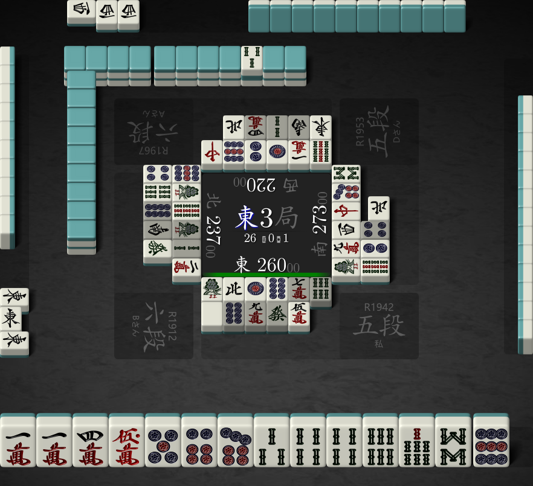

# Docker Quick Start
A handy `Dockerfile` has been added to the project for an easy and quick start.

```admonish warning
This Docker image is only designed for inference with mjai interface and is not targeted for training.
```

## Build
```shell
$ git clone https://github.com/Equim-chan/Mortal.git
$ cd Mortal
$ sudo env DOCKER_BUILDKIT=1 docker build -t mortal:latest .
```

## Prepare a trained model
The Docker image does not contain any model file of Model, therefore it must be prepared separately under a directory, which will be demonstrated as `/path/to/model/dir` below. In this example, snapshot `mortal1-b40c192-t22040618` is used.

## Example
We are going to use Mortal to evaluate the next move for the scene shown in _Figure 1_.


<p class="caption">Figure 1</p>

First things first, we need to identify the POV's player ID. A player ID is an immutable number that identifies a specific player throughout one game. The rule is simple, the player sitting at the East at E1 is 0, and his shimocha (right) will be 1, toimen (across) will be 2, kamicha (left) will be 3. This works exactly the same as the `tw` parameter in Tenhou's log URL.

In this case, the POV's player ID is 2, because his seat is West at E1.

Mortal speaks mjai <!-- TODO: link to doc -->, a simple and easy-to-read stream format for mahjong records. From the perspective of player 2, the equivalent masked mjai events he has perceived so far are:

```js
{"type":"start_game"}
{"type":"start_kyoku","bakaze":"E","dora_marker":"3s","kyoku":3,"honba":0,"kyotaku":0,"oya":2,"scores":[22000,23700,26000,28300],"tehais":[["?","?","?","?","?","?","?","?","?","?","?","?","?"],["?","?","?","?","?","?","?","?","?","?","?","?","?"],["1m","1m","4m","5m","1p","5p","8p","1s","4s","4s","6s","8s","N"],["?","?","?","?","?","?","?","?","?","?","?","?","?"]]}
{"type":"tsumo","actor":2,"pai":"6p"}
{"type":"dahai","actor":2,"pai":"1s","tsumogiri":false}
{"type":"tsumo","actor":3,"pai":"?"}
{"type":"dahai","actor":3,"pai":"1s","tsumogiri":false}
{"type":"tsumo","actor":0,"pai":"?"}
{"type":"dahai","actor":0,"pai":"9s","tsumogiri":false}
{"type":"tsumo","actor":1,"pai":"?"}
{"type":"dahai","actor":1,"pai":"9p","tsumogiri":false}
{"type":"tsumo","actor":2,"pai":"3s"}
{"type":"dahai","actor":2,"pai":"N","tsumogiri":false}
{"type":"tsumo","actor":3,"pai":"?"}
{"type":"dahai","actor":3,"pai":"9m","tsumogiri":false}
{"type":"tsumo","actor":0,"pai":"?"}
{"type":"dahai","actor":0,"pai":"1m","tsumogiri":false}
{"type":"tsumo","actor":1,"pai":"?"}
{"type":"dahai","actor":1,"pai":"1s","tsumogiri":false}
{"type":"tsumo","actor":2,"pai":"7s"}
{"type":"dahai","actor":2,"pai":"1p","tsumogiri":false}
{"type":"tsumo","actor":3,"pai":"?"}
{"type":"dahai","actor":3,"pai":"W","tsumogiri":false}
{"type":"tsumo","actor":0,"pai":"?"}
{"type":"dahai","actor":0,"pai":"1p","tsumogiri":false}
{"type":"tsumo","actor":1,"pai":"?"}
{"type":"dahai","actor":1,"pai":"W","tsumogiri":false}
{"type":"pon","actor":0,"target":1,"pai":"W","consumed":["W","W"]}
{"type":"dahai","actor":0,"pai":"2p","tsumogiri":false}
{"type":"tsumo","actor":1,"pai":"?"}
{"type":"dahai","actor":1,"pai":"9s","tsumogiri":false}
{"type":"tsumo","actor":2,"pai":"P"}
{"type":"dahai","actor":2,"pai":"8p","tsumogiri":false}
{"type":"tsumo","actor":3,"pai":"?"}
{"type":"dahai","actor":3,"pai":"C","tsumogiri":false}
{"type":"tsumo","actor":0,"pai":"?"}
{"type":"dahai","actor":0,"pai":"9p","tsumogiri":false}
{"type":"tsumo","actor":1,"pai":"?"}
{"type":"dahai","actor":1,"pai":"1s","tsumogiri":true}
{"type":"tsumo","actor":2,"pai":"7m"}
{"type":"dahai","actor":2,"pai":"7m","tsumogiri":true}
{"type":"tsumo","actor":3,"pai":"?"}
{"type":"dahai","actor":3,"pai":"7p","tsumogiri":false}
{"type":"tsumo","actor":0,"pai":"?"}
{"type":"dahai","actor":0,"pai":"C","tsumogiri":false}
{"type":"tsumo","actor":1,"pai":"?"}
{"type":"dahai","actor":1,"pai":"2s","tsumogiri":true}
{"type":"tsumo","actor":2,"pai":"6s"}
{"type":"dahai","actor":2,"pai":"6s","tsumogiri":true}
{"type":"tsumo","actor":3,"pai":"?"}
{"type":"dahai","actor":3,"pai":"E","tsumogiri":true}
{"type":"pon","actor":1,"target":3,"pai":"E","consumed":["E","E"]}
{"type":"dahai","actor":1,"pai":"2m","tsumogiri":false}
{"type":"tsumo","actor":2,"pai":"7p"}
{"type":"dahai","actor":2,"pai":"P","tsumogiri":false}
{"type":"tsumo","actor":3,"pai":"?"}
{"type":"dahai","actor":3,"pai":"8s","tsumogiri":false}
{"type":"tsumo","actor":0,"pai":"?"}
{"type":"dahai","actor":0,"pai":"E","tsumogiri":false}
{"type":"tsumo","actor":1,"pai":"?"}
{"type":"dahai","actor":1,"pai":"4p","tsumogiri":false}
{"type":"tsumo","actor":2,"pai":"8p"}
{"type":"dahai","actor":2,"pai":"8p","tsumogiri":true}
{"type":"tsumo","actor":3,"pai":"?"}
{"type":"dahai","actor":3,"pai":"9s","tsumogiri":false}
{"type":"tsumo","actor":0,"pai":"?"}
{"type":"dahai","actor":0,"pai":"S","tsumogiri":true}
{"type":"tsumo","actor":1,"pai":"?"}
{"type":"dahai","actor":1,"pai":"6s","tsumogiri":false}
{"type":"tsumo","actor":2,"pai":"9m"}
{"type":"dahai","actor":2,"pai":"9m","tsumogiri":true}
{"type":"tsumo","actor":3,"pai":"?"}
{"type":"dahai","actor":3,"pai":"2p","tsumogiri":false}
{"type":"tsumo","actor":0,"pai":"?"}
{"type":"dahai","actor":0,"pai":"2s","tsumogiri":true}
{"type":"tsumo","actor":1,"pai":"?"}
{"type":"dahai","actor":1,"pai":"8p","tsumogiri":true}
{"type":"tsumo","actor":2,"pai":"F"}
{"type":"dahai","actor":2,"pai":"F","tsumogiri":true}
{"type":"tsumo","actor":3,"pai":"?"}
{"type":"dahai","actor":3,"pai":"4p","tsumogiri":true}
{"type":"tsumo","actor":0,"pai":"?"}
{"type":"dahai","actor":0,"pai":"4m","tsumogiri":true}
{"type":"tsumo","actor":1,"pai":"?"}
{"type":"dahai","actor":1,"pai":"S","tsumogiri":true}
{"type":"tsumo","actor":2,"pai":"5mr"}
{"type":"dahai","actor":2,"pai":"5m","tsumogiri":false}
{"type":"tsumo","actor":3,"pai":"?"}
{"type":"reach","actor":3}
{"type":"dahai","actor":3,"pai":"N","tsumogiri":false}
{"type":"reach_accepted","actor":3}
{"type":"tsumo","actor":0,"pai":"?"}
{"type":"dahai","actor":0,"pai":"N","tsumogiri":false}
{"type":"tsumo","actor":1,"pai":"?"}
{"type":"dahai","actor":1,"pai":"F","tsumogiri":false}
{"type":"tsumo","actor":2,"pai":"9p"}
```

Save the mjai log content above into a file named `log.json`, then run:

```shell
$ sudo docker run -i --rm -v /path/to/model/dir:/mnt mortal 2 < log.json
```

This will output a series of new-line-separated JSONs, each of which represents Mortal's reaction to an mjai event that it is able to react to, with the last line corresponding to the scene illustrated above:

```json
{
  "type": "dahai",
  "actor": 2,
  "pai": "9p",
  "tsumogiri": true,
  "meta": {
    "q_values": [
      -1.1929103,
      -1.5628747,
      -1.6204606,
      -1.607082,
      -1.3267958,
      -0.2436666,
      -1.5208447,
      -1.5280346,
      -1.5830542,
      -1.6640469,
      -1.1801766,
      -1.8054415
    ],
    "mask_bits": 17241923593,
    "is_greedy": true,
    "batch_size": 1,
    "shanten": 1,
    "eval_time_ns": 30352000
  }
}
```

From the JSON output we can clearly read that Mortal would like to discard 9p in this scene.

```admonish tip
The field `meta` is not defined in mjai and is completely optional. In Mortal, this field is used to record metadata such as its network's raw outputs and evaluation time.
```

Don't shut down the process yet. Now let's go one turn further. The player discarded 9p, passed a 1m pon, and here it comes the next scene:


<p class="caption">Figure 2</p>

The mjai events the player perceived since _Figure 1_ are:

```js
{"type":"dahai","actor":2,"pai":"9p","tsumogiri":true}
{"type":"tsumo","actor":3,"pai":"?"}
{"type":"dahai","actor":3,"pai":"2p","tsumogiri":true}
{"type":"tsumo","actor":0,"pai":"?"}
{"type":"dahai","actor":0,"pai":"8s","tsumogiri":false}
{"type":"tsumo","actor":1,"pai":"?"}
{"type":"dahai","actor":1,"pai":"1m","tsumogiri":false}
{"type":"tsumo","actor":2,"pai":"3p"}
```

Paste them into the running process's input (or just append these to `log.json` and re-run the command), and we will get Mortal's reactions to them.

First, there will be a `none` type action, which means Mortal would pass the 1m pon:

```json
{
  "type": "none",
  "meta": {
    "q_values": [
      -1.2190987,
      -0.084070235
    ],
    "mask_bits": 37383395344384,
    "is_greedy": true,
    "batch_size": 1,
    "shanten": 1,
    "eval_time_ns": 29667100
  }
}
```

Then a `dahai` event will follow, which corresponds to the scene in _Figure 2_:

```json
{
  "type": "dahai",
  "actor": 2,
  "pai": "1m",
  "tsumogiri": false,
  "meta": {
    "q_values": [
      -0.22652823,
      -1.7668037,
      -1.0071788,
      -1.7482929,
      -1.7783809,
      -1.5943735,
      -1.5575972,
      -1.5641792,
      -1.6780779,
      -1.7836256,
      -1.5739789,
      -1.915102
    ],
    "mask_bits": 17241794569,
    "is_greedy": true,
    "batch_size": 1,
    "eval_time_ns": 29686500
  }
}
```

We can tell that Mortal would choose to discard 1m at this point.
